<link rel="stylesheet" type="text/css" href="style.css"/>

# List of Station Maps

Though I didn't know of any maps of Dudley Station at the start of this project, I've since found a few. They're all here, along with other MBTA station maps I've found, and a few from outside MBTA.

If you find more maps, please send them to me.

## Maps of Dudley Station

* This map is posted at Dudley Station, but it's, uh, not great, and also doesn't exist online.

* My first version, April 2017.

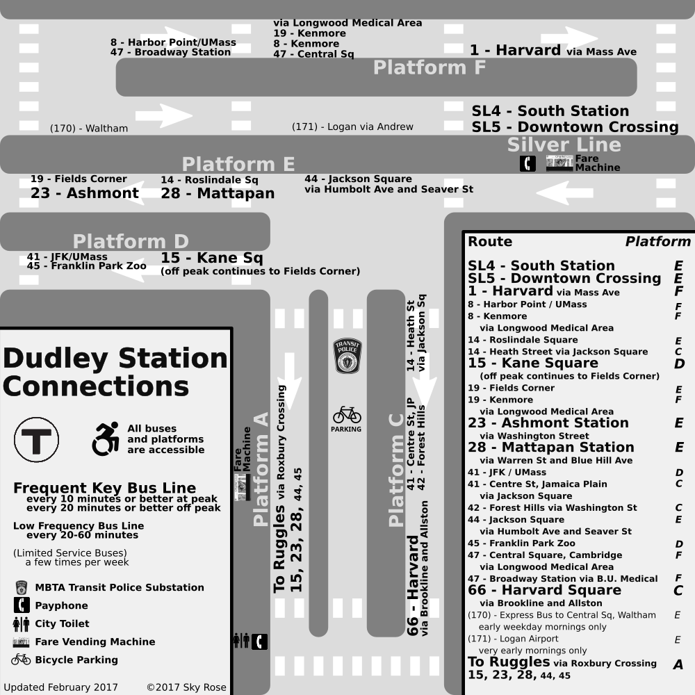

[PNG](dudley_sky_rose_v1.png) [SVG](dudley_sky_rose_v1.svg)

* A map made by Nathaniel Fruchter, in response to seeing my first version. I adapted a number of ideas from it into my second version.

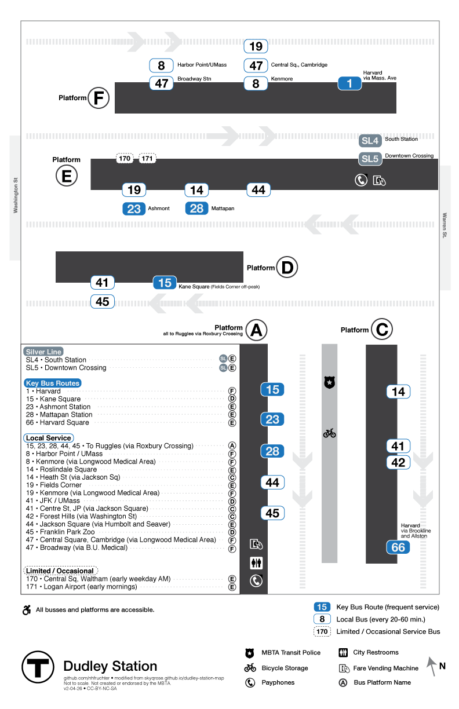

[PNG](https://github.com/nhfruchter/dudley-map/raw/master/dudley%20map%2011x17.png) [SVG](https://raw.githubusercontent.com/nhfruchter/dudley-map/master/MBTA%20Dudley.svg) [Github](https://github.com/nhfruchter/dudley-map)

* My second and most recent version.

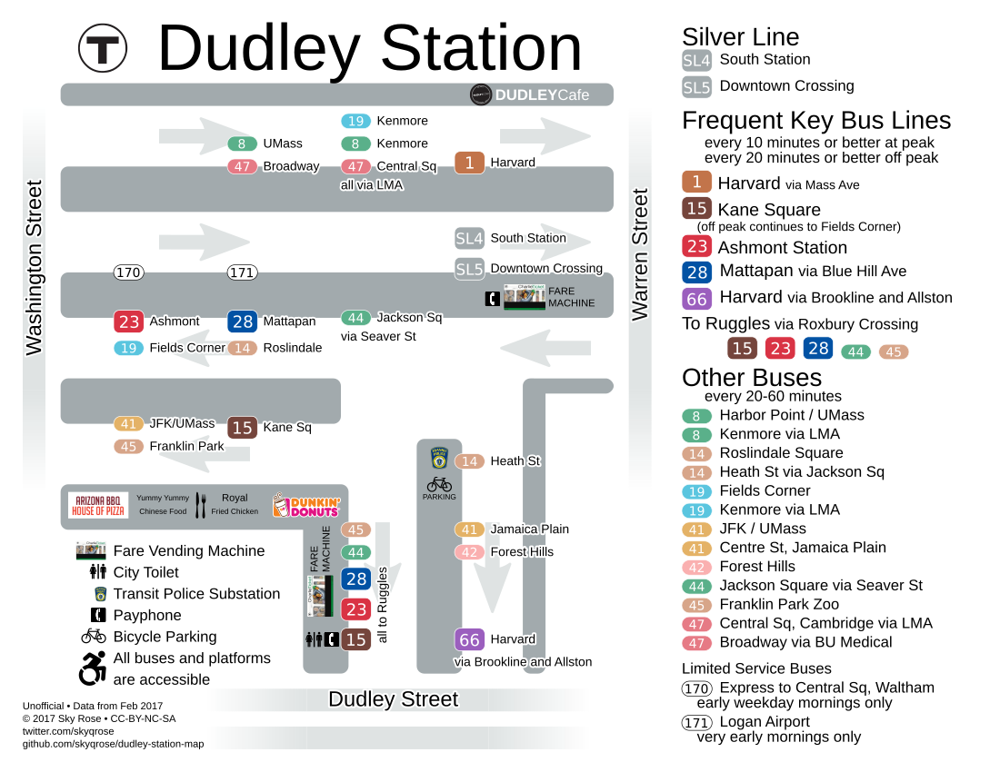

[PNG](../Dudley_Station_Map.png) [PDF](../Dudley_Station_Map.pdf) [SVG](../Dudley_Station_Map.svg) [Github](https://github.com/skyqrose/dudley-station-map)

* By Andrew Stokols, 2015, as part of a [student project reimagining Dudley Square as a neighborhood Hub](https://www.andrewstokols.com/dudley-square-transit-hub-to-neighborhood-hub/). It's made for urban planning, not navigation.

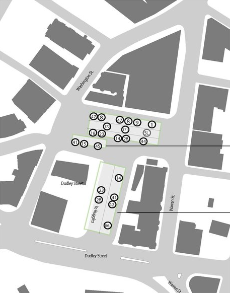

* [Miles on the MBTA's review of Dudley station, 2014](http://milesonthembta.blogspot.com/2014/06/dudley.html)

## A new MBTA standard

The MBTA has begun to standardize on this map style.
I don't like the style (having to remember a berth letter/number requires extra mental load, the lack of color makes the maps hard to navigate, and there's too much irrelevant detail),
but it's more important that these maps are widespread and consistent than that they're good.

Right now I only know of these two examples. Please make more, MBTA!

* Orient Heights

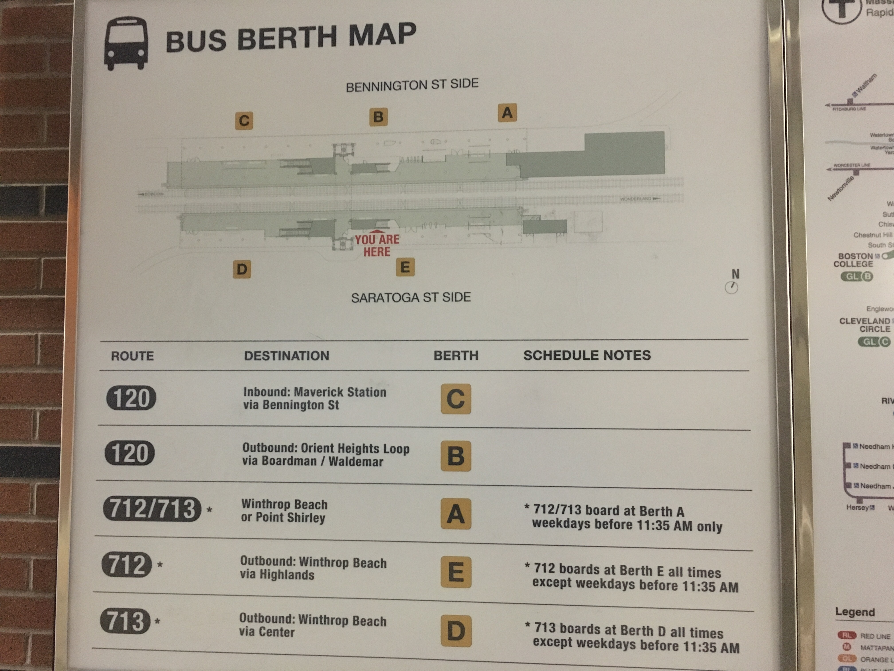

[PDF]("orient_heights.pdf")

* Sullivan Lower Busway Construction

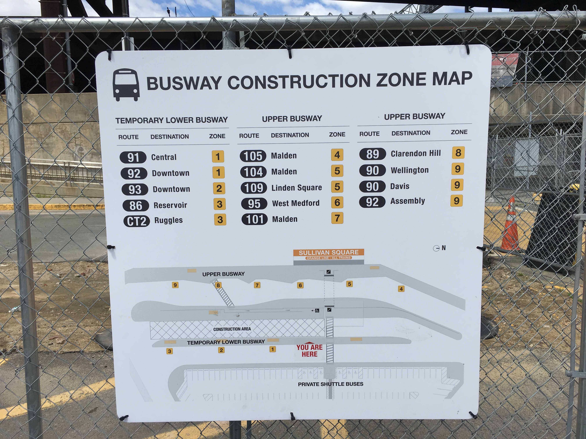

[PDF]("sullivan_construction.pdf")

## Other MBTA station maps

* Ashmont

* Alewife

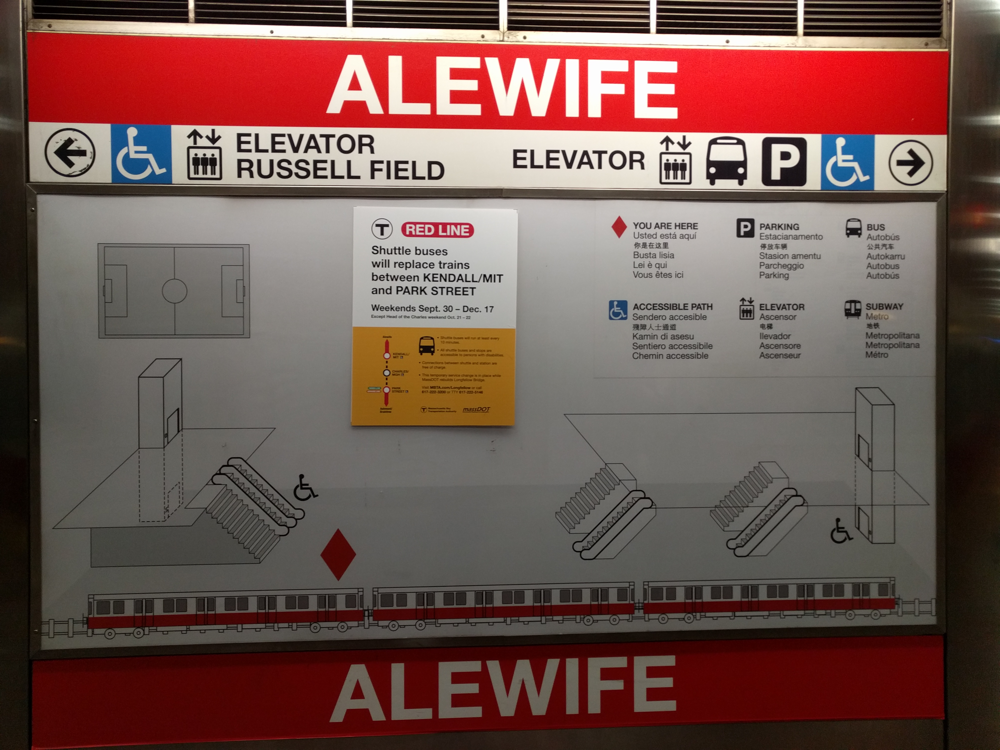

* Downtown Crossing, at 101 Arch St

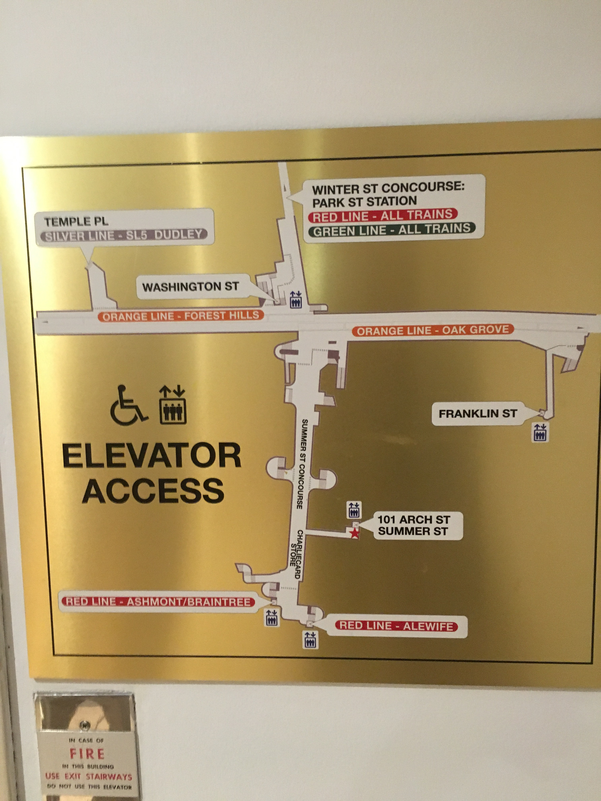

* Copely

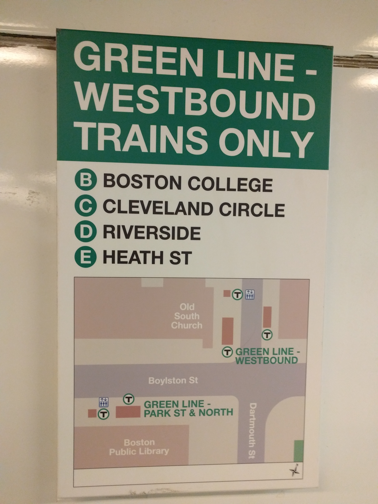

* Forest Hills, notice of Route 39 stop location change.

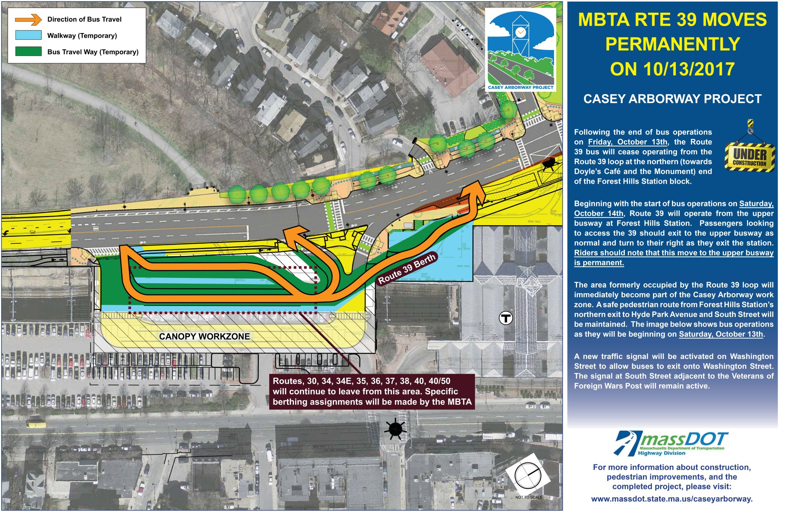

* Park St elevator detour to DTX

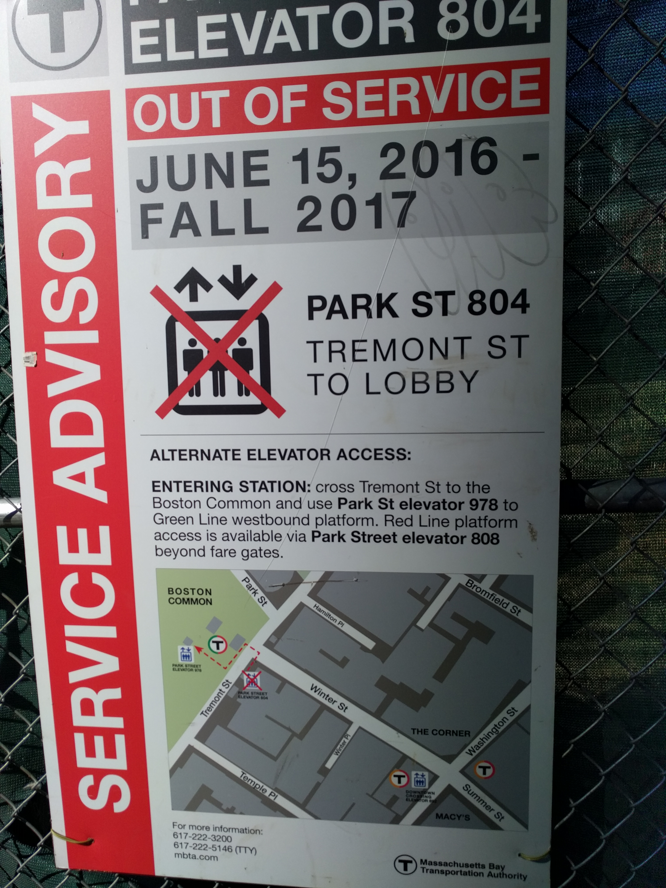

* Emergency Training Center, under Broadway

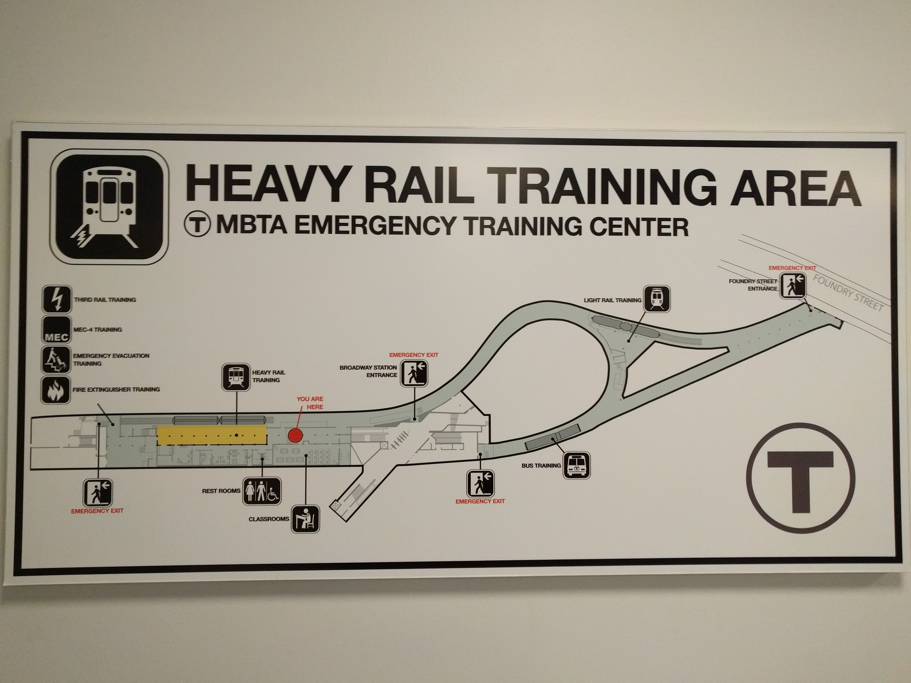

* I also have maps of Dudley and Harvard platforms made by MBTA but never used, that I've been asked not to post publicly.

## Outside the MBTA

* Transport for London maintains a series of bus stop maps in busy areas.

[Index](https://tfl.gov.uk/maps_/bus-spider-maps)

Here's a good example:

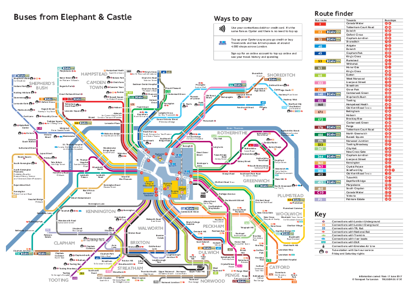

* This [collection of historical cutaway images of the London Tube](http://londonist.com/london/transport/london-cutaways). An example:

* [A series of 3D-Models of some of London's most interesting stations](http://stations.aeracode.org/). Andrew Godwin, 2012.
