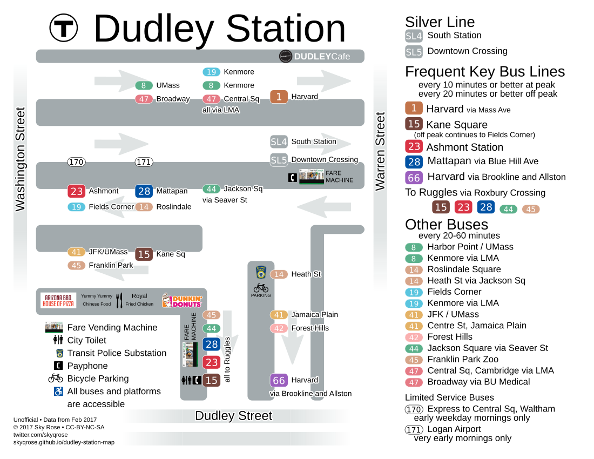

<link rel="stylesheet" type="text/css" href="style.css"/>

# List of Station Maps

Though I didn't know of any maps of Dudley Station at the start of this project, I've since found a few. They're all here, along with other MBTA station maps I've found, and a few from outside MBTA.

If you find more maps, please send them to me.

## Maps of Dudley Station

* This map is posted at Dudley Station, but it's, uh, not great, and also doesn't exist online.

* My first version, April 2017.

[PNG](dudley_sky_rose_v1.png) [SVG](dudley_sky_rose_v1.svg)

* The cartographer at MassDOT made this map a while ago.

[source](https://twitter.com/stevenbeaucher/status/857605821424951297) 

* A map made by Nathaniel Fruchter, in response to seeing my first version. I adapted a number of ideas from it into my second version.

[PNG](https://github.com/nhfruchter/dudley-map/raw/master/dudley%20map%2011x17.png) [SVG](https://raw.githubusercontent.com/nhfruchter/dudley-map/master/MBTA%20Dudley.svg) [Github](https://github.com/nhfruchter/dudley-map)

* My second and most recent version.

[PNG](../Dudley_Station_Map.png) [PDF](../Dudley_Station_Map.pdf) [SVG](../Dudley_Station_Map.svg) [Github](https://github.com/skyqrose/dudley-station-map)

* [Miles on the MBTA's review of Dudley station, 2014](http://milesonthembta.blogspot.com/2014/06/dudley.html)

## Other MBTA station maps

These photos were all taken by me.

* Ashmont

* Alewife

* Copely

* Park St elevator detour to DTX

## Outside the MBTA

* Transport for London maintains a series of bus stop maps in busy areas.

[Index](https://tfl.gov.uk/maps_/bus-spider-maps)

Here's a good example:

